# Anatomía de la motosierra

## Un análisis con Inteligencia Artificial de la reconfiguración del Estado argentino 2023-2025

<!-- CAMBIAR "https://place-hold.it/1920x1080" POR EL LINK A LA IMAGEN CORRESPONDIENTE -->
[](https://fund.ar) <!-- LINK A LA PUBLICACIÓN -->

[](https://creativecommons.org/licenses/by/4.0/)
<!-- [](https://zenodo.org/doi/10.5281/zenodo.11186044) -->

### Tabla de contenidos

- [Anatomía de la motosierra](#anatomía-de-la-motosierra)
  - [Un análisis con Inteligencia Artificial de la reconfiguración del Estado argentino 2023-2025](#un-análisis-con-inteligencia-artificial-de-la-reconfiguración-del-estado-argentino-2023-2025)
    - [Tabla de contenidos](#tabla-de-contenidos)
    - [Introducción](#introducción)
    - [Preparación del entorno](#preparación-del-entorno)
    - [Descripción de las variables de entorno](#descripción-de-las-variables-de-entorno)
    - [Estructura del repositorio](#estructura-del-repositorio)
    - [¿Qué es el BIME?](#qué-es-el-bime)
    - [Construcción del árbol](#construcción-del-árbol)
    - [*Notebooks* disponibles](#notebooks-disponibles)
      - [`dashboard.ipynb`](#dashboardipynb)
        - [Scraping](#scraping)
        - [Cleaning](#cleaning)
        - [Finding](#finding)
        - [Prompting](#prompting)
        - [LLMExtraction](#llmextraction)
      - [`heatmaps.ipynb`](#heatmapsipynb)
      - [`heatmaps_viewer.ipynb`](#heatmaps_vieweripynb)
      - [`lemas.ipynb`](#lemasipynb)
    - [Herramienta de visualización interna](#herramienta-de-visualización-interna)

### Introducción

Este repositorio forma parte del trabajo ***Anatomía de la motosierra: Un análisis con Inteligencia Artificial de la reconfiguración del Estado argentino 2023-2025*** (Link a la publicación) publicado por el Área de Datos de [Fundar](https://fund.ar). En dicho trabajo nos propusimos analizar la fragmentación y superposición de funciones de las distintas unidades estatales, a raíz de las diferentes reformas que afectaron al organigrama estatal y que fueron llevadas a cabo por Federico Sturzenegger en su rol de Ministro de Desregulación y Transformación del Estado durante la presidencia de Javier Milei, en particular durante la vigencia de las facultades extraordinarias aprobadas en la Ley Bases.

Para ello, consideramos como punto de partida la estructura estatal al **09/12/2023** (previo a la asunción de Milei) y la comparamos contra la misma al **08/07/2025** (vencimiento de las facultades extraordinarias). Ambos organigramas fueron recontruídos utilizando la Base Integrada de Mapa del Estado (BIME) vigente a las fechas mencionadas.

> [!NOTE]
> Para el análisis de la fragmentación y superposición, era necesario obtener las responsabilidades y funciones vigentes a ambas fechas para cada una de las unidades estatales. Utilizando como fuente los diversos enlaces dentro de los archivos BIME, se obtuvieron los datos requeridos con herramientas de *web scraping*, procesamiento de lenguaje natural y LLM.

### Preparación del entorno

> [!IMPORTANT]
> Prerequisitos: Python 3.13, GIT y [GIT LFS](https://git-lfs.com)

> [!TIP]
> Recomendamos utilizar [`uv`](https://docs.astral.sh/uv/getting-started/installation/) como *package-manager*

* Sincronizamos las dependencias 
  * `uv sync`
* Creamos un archivo `.env`
  * `cp .env.sample .env`
* El contenido del `.env` de ejemplo es:
  
```sh
LLM_MODEL=GPT_4O_MINI
CHROME_MAIN_VERSION=139
OPENAI_API_KEY=sk-...
TIME_TO_SLEEP=40
```

* Descargamos el modelo LLM local deseado (descargar el que se utilice según la variable `LLM_MODEL`)
  * `ollama pull llama3:instruct`

> [!TIP]
> La descarga de modelos de Ollama se puede omitir si se utiliza modelos de OpenAI.

* Activamos el entorno virtual (por ejemplo en Windows con Powershell)
  * `.\.venv\Scripts\activate.ps1`
* Si se desea crear una nueva base de datos:
  * `alembic upgrade head`

> [!NOTE]
> Se provee una base de datos existente con toda la información necesaria, desde las unidades para ambos años junto con sus funciones y responsabilidades primarias hasta los *prompts* utilizados para la obtención de dichos datos.

### Descripción de las variables de entorno
  
| Variable              | Ejemplo               | Descripción                                                                                 |
|----------------------|------------------------|---------------------------------------------------------------------------------------------|
| `LLM_MODEL`          | `GPT_4O_MINI`          | Modelo de lenguaje que usará el sistema para procesar texto. Valores disponibles en `chainsaw/enum/llm_models.py`. |
| `CHROME_MAIN_VERSION`| `139`                  | Versión principal de Chrome que debe usar el driver de Selenium para asegurar compatibilidad. Dependerá de tu versión del navegador. |
| `OPENAI_API_KEY`     | `sk-...`               | Clave de API de OpenAI necesaria para autenticar peticiones al servicio. Sólo requerida si `LLM_MODEL` es de dicho proveedor. |
| `TIME_TO_SLEEP`      | `40`                   | Tiempo (en segundos) que el sistema debe esperar entre ejecuciones de *prompt*. Útil para evitar *rate-limits*. |

> [!CAUTION]
> Mantené tu *key* de OpenAI en tu entorno local, no la subas junto a tu archivo `.env` a ningún repositorio.

### Estructura del repositorio

```plaintext
anatomia-de-la-motosierra/
├── .venv/                     # Entorno virtual
├── alembic/                   # Migraciones de base de datos (SQLAlchemy + Alembic)
├── analysis/                  # Notebooks de análisis y visualización
│   ├── clusters/              # JSONs con info de todas las unidades filtradas y clusterizadas
│   ├── finals/                # JSONs a los que se les aplicó el algoritmo de heatmaps para encontrar superposiciones
│   ├── fragmentation/         # Resultados del análisis de fragmentación
│   ├── ui/                    # Elementos visuales para los notebooks
│   ├── dashboard.ipynb        # Descarga de CSV's, construcción de árboles, plots, etc
│   ├── heatmaps_viewer.ipynb  # Visualización rápida de heatmaps
│   ├── heatmaps.ipynb         # Creación de heatmaps
│   └── lemas.ipynb            # Obtención de n-gramas frecuentes en las funciones
├── chainsaw/                  # Código fuente principal del proyecto
├── data/                      # Datos persistentes
│   ├── estructura/            # Archivos CSV del BIME
│   └── database.db            # Base de datos SQLite
├── docs/                      # Imágenes relacionadas con la documentación del repositorio
├── .env.sample                # Archivo de ejemplo para variables de entorno
├── .gitattributes             # Configuración para GIT LFS
├── .gitignore                 # Lo que impide que subas tu key de OpenAI a algún repositorio público
├── CITATION.cff               # Normas para citar éste proyecto
├── LICENSE                    # La licencia de éste proyecto
├── pyproject.toml             # Configuración del proyecto, metadata y dependencias
└── README.md                  # Éste archivo
```

### ¿Qué es el BIME?

Es la Base Integrada de Mapa del Estado, un gran archivo *CSV* que contiene las designaciones de todos los funcionarios del organigrama del Estado.

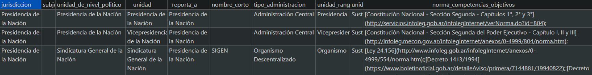

En teoría debería ser un consolidado de todas las designaciones publicadas en el Boletín Oficial que están vigentes a la fecha de publicación del archivo. Se puede descargar [aquí](https://mapadelestado.jefatura.gob.ar). Algunas de las columnas mas relevantes:

* Jurisdiccion
* Subjurisdiccion
* Unidad de nivel político
* Unidad
* Reporta a: Éste es el dato que utilizamos para transformar el organigrama de un archivo *csv* a un grafo. 
* Tipo administracion: Administración central, Organismo descentralizado, Organismo desconcentrado, etc.
* Unidad rango: Presidencia, Vicepresidencia, Ministerio, Secretaría, Subsecretaría, Dirección, Coordinación, etc.
* Unidad clase: Sustantiva, Apoyo o Control.
* Norma competencias objetivos: Un listado (aparentemente exhaustivo pero muy mal cargado) de las distintas normas oficiales vinculadas con la unidad/cargo.
* Cargo: Cargo que ocupa la persona referida en la designación de la fila correspondiente.
* Autoridad nombre: Nombre de la persona que ocupa el cargo.
* Autoridad apellido: Apellido de la persona que ocupa el cargo.

### Construcción del árbol

Como se comentó, el archivo BIME es un archivo *csv* inmenso con miles de filas. Un gran listado de cargos estatales. Como cada cargo tiene asociada una unidad estatal y sabemos que ésta a su vez le reporta a una segunda unidad, si repetimos este patrón sucesivamente podremos reconstruir el grafo equivalente. El siguiente diagrama sirve de ejemplo para visualizar las relaciones mencionadas.

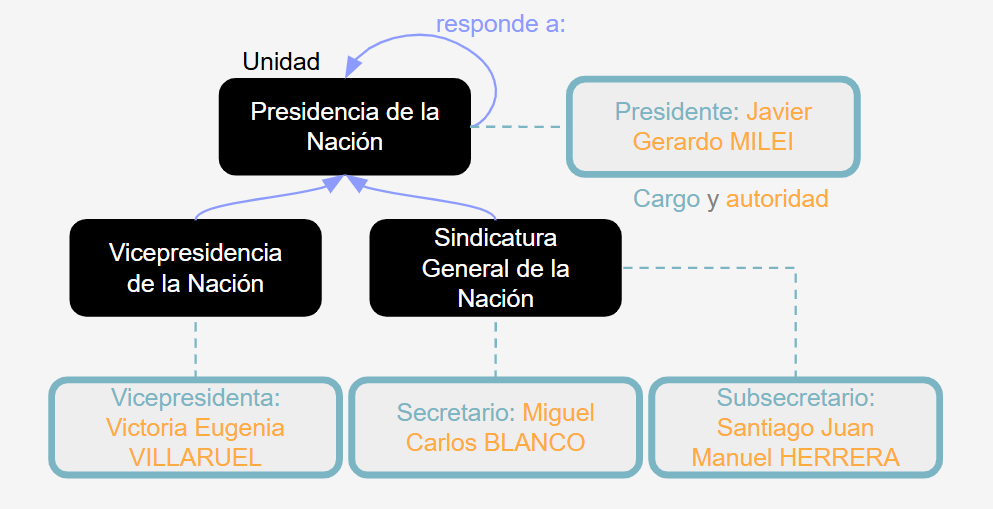

### *Notebooks* disponibles

#### `dashboard.ipynb`

Éste fue el primer cuaderno desarrollado. En él es posible:

* Descargar el BIME (CSV) mas reciente.
  * Haciendo click en el botón Descargar CSV
  * Igualmente, los BIME de las fechas seleccionadas ya están en `data/estructura/`.

* Reconstruir el árbol jerárquico del Estado basándose en algún BIME.
  * Elegir el BIME deseado en el desplegable CSV y hacer click en Crear Árbol.

> [!TIP]
> Si se utiliza la base de datos provista, la reconstrucción debería ser instantánea.

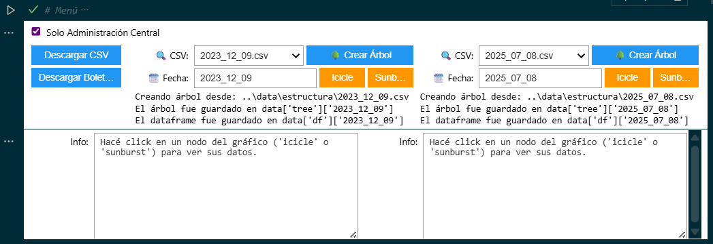

* Realizar gráficos Icicle o Sunburst de los árboles en memoria.
  * Al hacer click sobre las unidades dentro de los gráficos, es posible navegar el organigrama.
  
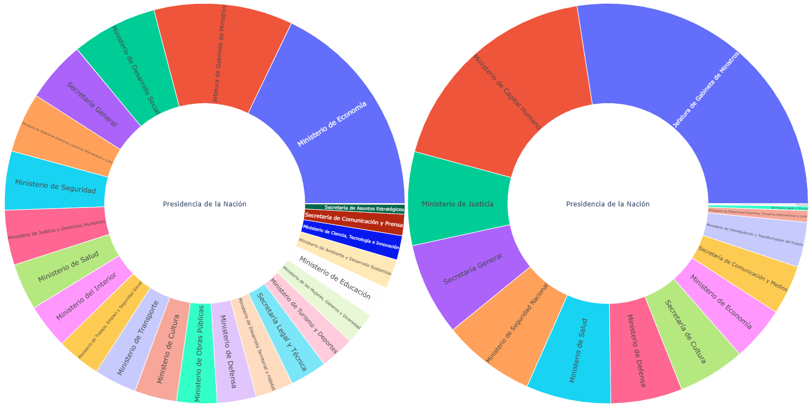

* Construir *clústers* de las unidades (de uno o ambos años) en base a la similitud de las funciones.
  * Se pueden elegir subjerarquías, cambiar parámetros del algoritmo de *clustering* (HDBSCAN) o filtrar por tipo de unidad.

> [!IMPORTANT]
> En los experimentos publicados se han filtrado algunas unidades y rangos específicos. Ésto se puede editar en el método `__units_from` del archivo `chainsaw/clusters.py`.

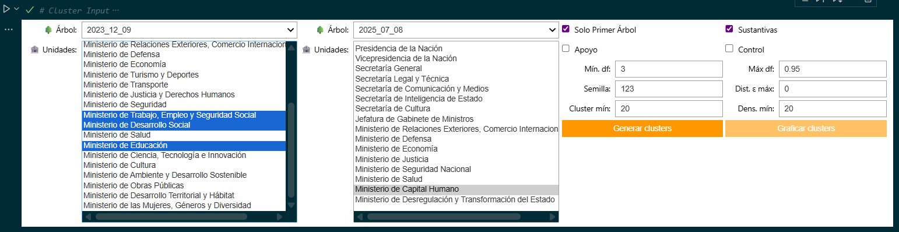

* Analizar la distribución de las unidades por año, rango y tipo.
  * Se calcula en base a los árboles filtrados por el proceso de *clustering*.

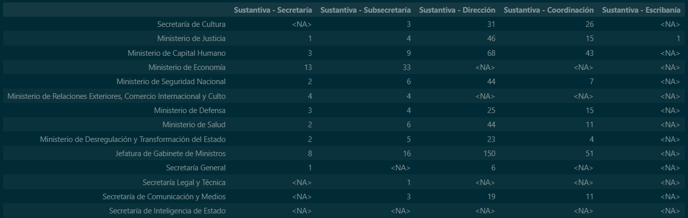

* En la sección de Fragmentación y dado un conjunto de lemas que definen grandes categorías, se puede:
  * Buscar aquellas unidades en cuyas funciones se hace referencia a los mismos.
  * Luego, calcular el Número Efectivo de Ministerios por categoría.

* En la sección siguiente se pueden descargar los clusters obtenidos a distintos archivos *json*, para luego compartilos y visualizarlos (se ha desarrollado internamenta una herramienta web para compartir los clusters resultantes entre los investigadores y visualizar distintos escenarios).
  * Como en principio HDBSCAN sólo agrupa unidades bajo algún número que los identifique, en ésta sección hay un bloque que permite *promptear* rápidamente a algún LLM, indicándole que genere un *label* para cada clúster según los nombres de las unidades que lo conforman. Dichos nombres se guardan también en el *json*.

* Finalmente, si se desea ejecutar nuevamente el proceso de obtención de las responsabilidades primarias (y no utilizar la base de datos provista) se puede ejecutar el bloque:

```python
# Ejecutar procesamiento de documentos oficiales

for date in ("2023_12_09", "2025_07_08"):
    with SessionLocal() as session:
        Pipeline.start(
            session,
            tree=data['tree'][date],
            steps=[
                Scrapping(),
                Cleaning(),
                Finding(),
                Prompting(),
                LLMExtraction(processes_amount=5),
            ],
            override=False,
        )
```

* Si alguno de los pasos ya fue realizado y los resultados se encuentran en la base, se puede reutilizar y sólo ejecutar los siguientes. Para ello se puede comentar el paso a omitir. Por ejemplo, si se quiere reutilizar los documentos obtenidos mediante el *scraping* pero se desea realizar de nuevo el proceso de limpieza y obtención de parráfos relevantes en el paso de *Finding*, alcanza con comentar la línea `Scrapping()`.

##### Scraping

Dado un árbol en memoria, se recorren sus nodos unidad, se obtienen las direcciones URL vinculadas (extraídas previamente del respectivo archivo BIME, más especificamente de la columna `norma_competencias_objetivos`, durante el proceso de construcción del árbol) y con `Selenium` se hace *web scraping*, obteniendo textos planos (que se almacenan en la base de datos) a partir del cuerpo de normativas publicadas en Infoleg o en el Boletín oficial, ya sea en formato web o anexos *pdf*.

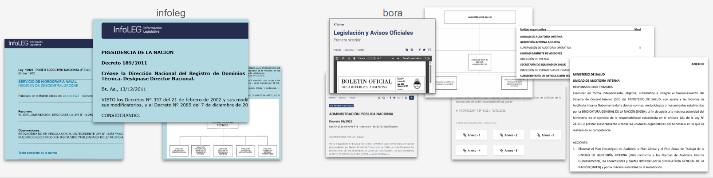

##### Cleaning

Se normalizan los textos y se realiza una limpieza de archivos.

##### Finding

Como en un mismo texto es usual que se haga mención a las responsabilidades de decenas de unidades (alcanzando así muchas páginas por archivo), es imprescindible detectar los párrafos relevantes a la unidad deseada. Con técnicas de PLN y heurísticas, se obtienen bloques de texto mucho mas pequeños y precisos. Por ejemplo:

* El promedio del largo de los párrafos del documento debe ser mayor a 30 caracteres.
* El bloque de texto debe presentar el nombre de la unidad deseada (normalizada y tokenizada).
* Se busca la presencia de palabras clave como "Responsabilidad primaria", "Acciones", etc.

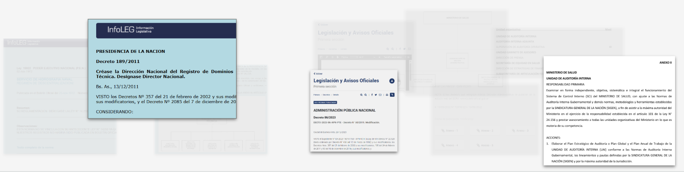

##### Prompting

Por cada unidad se genera un prompt para LLM, optimizado para detectar de entre los bloques seleccionados aquel que describe las funciones de la misma a la fecha.

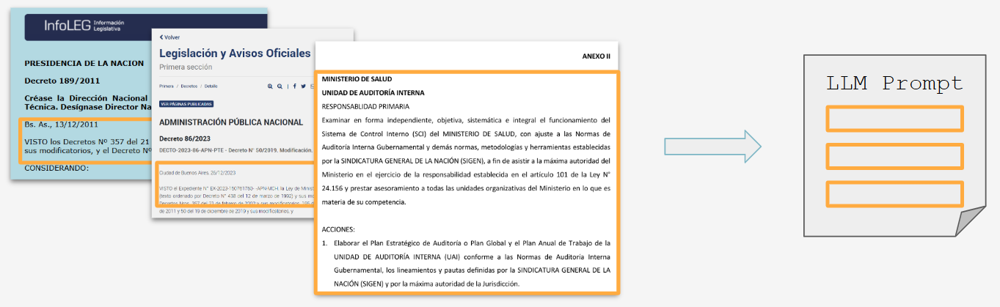

##### LLMExtraction

Se ejecuta el *prompt* y si la respuesta es satisfactoria, se obtiene el texto que contiene las responsabilidades primarias de la unidad consultada. Se pueden lanzar múltiples procesos en simultáneo.

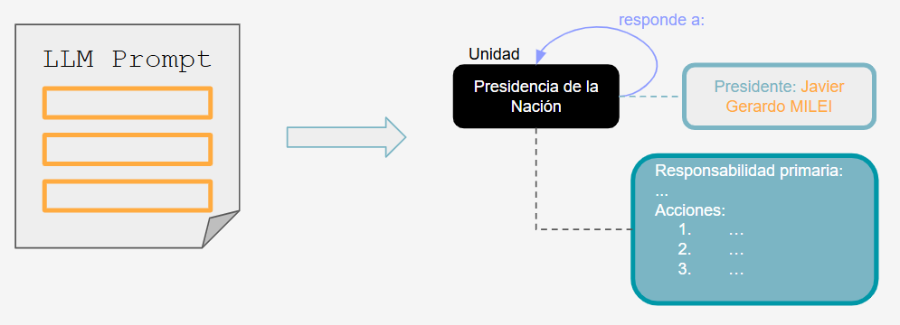

#### `heatmaps.ipynb`

En este cuaderno partimos de algún archivo *json* con la información de los *clústers* obtenidos en el experimento anterior. Luego, para cada *clúster* del archivo calcularemos las distintas matrices que representan el nivel de similitud entre todas las unidades de un mismo *clúster*. Una matriz por cada una de las dimensiones en las que se compone nuestro índice de superposición (Link al Anexo de la publicación).

> [!IMPORTANT]
> Dado que el estudio se centró finalmente en unidades de rango mayor o igual a subsecretaría, la muestra se redujo considerablemente y en instancias finales decidimos omitir la etapa de *clustering*, forzando el análisis de superposición de todas las unidades entre sí y no sólo a las que compartían originalmente el mismo *clúster*.

El núcleo de éste cuaderno es el método `execute()` de la clase `LLMExtraction`. No confundir con la del *step* del *pipeline* de extracción de responsabilidades primarias, usado en el cuaderno `analysis/dashboard.ipynb`. Al ejecutarse, generará un nuevo *json* con las **"ocurrencias"** obtenidas para cada *clúster* y dimensión. Llamamos "ocurrencia" al hallazgo de (según la dimensión correspondiente) un objetivo, un destinatario, un ámbito, etc. La idea es comparar dichos hallazgos según dimensión utilizando similitud coseno, entre todas las unidades del mismo clúster. Más detalles de la metodología aquí (Link al Anexo de la publicación).

> [!IMPORTANT]
> El *json* de ocurrencias por dimensión y clúster generado por el proceso se almacena en `analysis/heatmaps/`.

> [!WARNING]
> Notar que para algunas de las dimensiones, dichas ocurrencias se obtendrán utilizando el modelo LLM configurado en las variables de entorno, por lo que su ejecución puede incurrir en gastos.

Es posible reutilizar los resultados de ejecuciones previas descomentando la dimensión deseada en el atributo `reuse`. Los datos los obtendrá de aquel archivo *json* almacenado en el directorio de `heatmaps` que fue generado a su vez por el archivo de *clústers* indicado en la *key* `cluster_file` del diccionario `data`.

Finalmente, el último bloque del cuaderno nos permite condensar los índices de similitud encontrados por dimensión para cada clúster en un nuevo y único archivo *json*, omitiendo así toda la información relativa a las ocurrencias. Este archivo se guardará en `analysis/finals`. Cabe mencionar que estos últimos *json* han sido nuestro mayor insumo para el estudio de superposición documentado aquí (Link a la publicación). Por tal motivo, se creó internamente una *webapp* para visualizar los escenarios obtenidos. Algunos *snapshots* de dicha herramienta se pueden ver en la sección [Herramienta de visualización interna](#herramienta-de-visualización-interna).

#### `heatmaps_viewer.ipynb`

En este cuaderno se pueden visualizar los archivos *json* generados para un único *clúster*. Ésto permite un rápido análisis del resultado del proceso mencionado anteriormente. Nuevamente, se utilizará el archivo de `heatmaps` que haya sido generado por el archivo *clústers* indicado en la *key* `cluster_file` del diccionario `data`. No se provee ningún archivo *heatmap* en el presente repositorio, pero en el cuaderno se deja cargado uno de ejemplo para apreciar el resultado que también se visualiza a continuación:

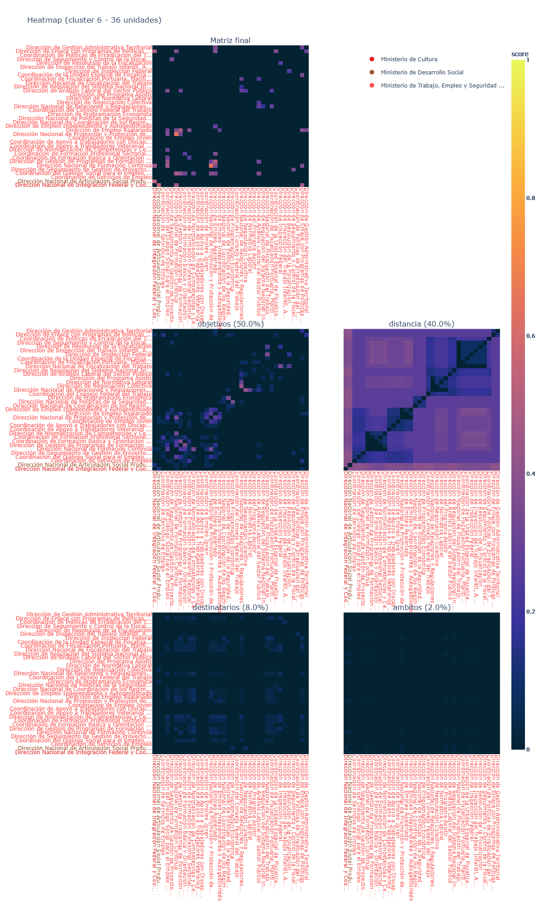

#### `lemas.ipynb`

Éste cuaderno contiene algunos *scripts* utilizados para el estudio de fragmentación, mencionado en el trabajo publicado aquí (Link a la publicación). Los resultados obtenidos se encuentran en la carpeta `analysis/fragmentation/`.

### Herramienta de visualización interna

Panel general

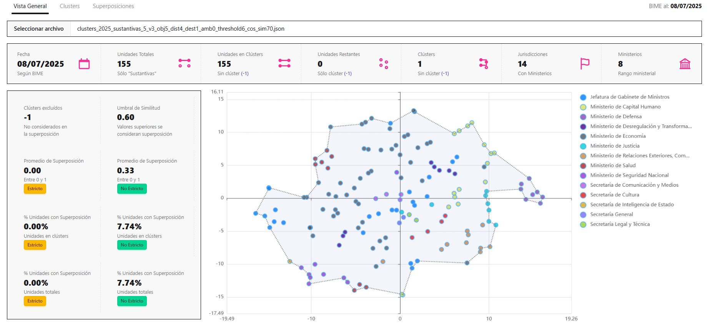

Listado de clústers

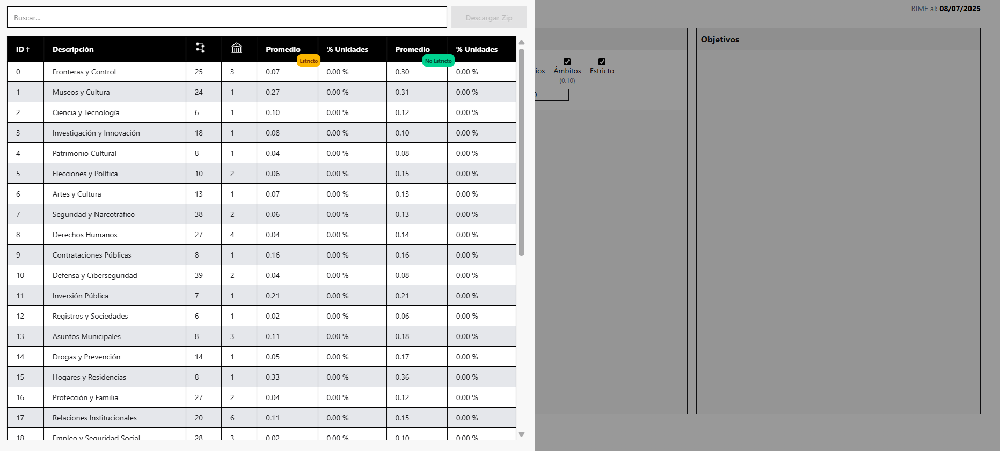

Vista de clúster y heatmap

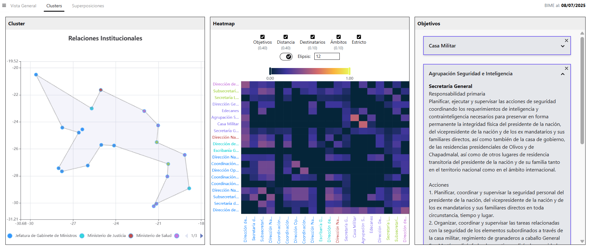

Listado de díadas con niveles de superposición

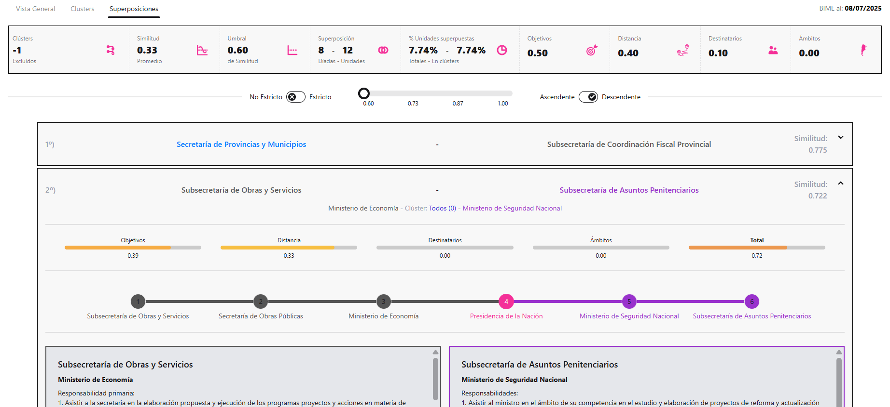

---
<div>&nbsp;</div>
<div>&nbsp;</div>
<div>
  &nbsp;
  <a href="https://fund.ar">
  <picture>
    <source media="(prefers-color-scheme: dark)" srcset="https://github.com/datos-Fundar/fundartools/assets/86327859/6ef27bf9-141f-4537-9d78-e16b80196959">
    <source media="(prefers-color-scheme: light)" srcset="https://github.com/datos-Fundar/fundartools/assets/86327859/aa8e7c72-4fad-403a-a8b9-739724b4c533">
    </img>
  </picture>
</a>
</div>
